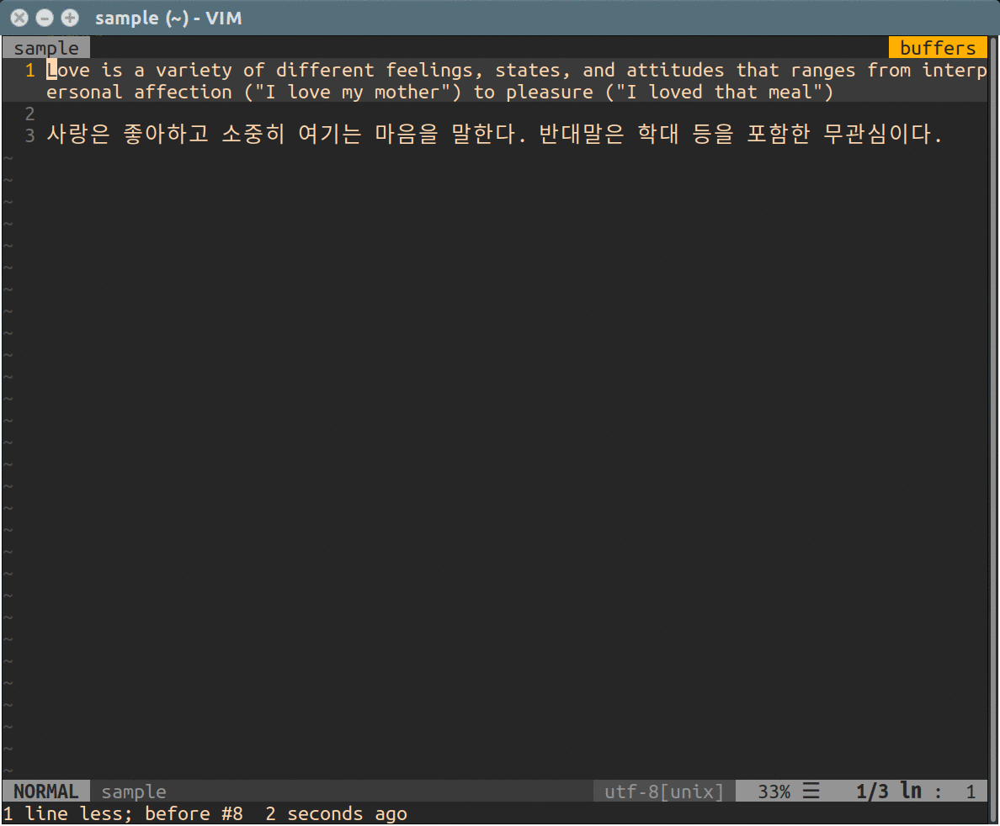

# vim-transit



**vim-transit** translates a given text from source language to target language via Google Translate API.

## Prerequisite

* vim with python support

## Installation

it's recommended that you use a plugin manager like [vim-plug](https://github.com/junegunn/vim-plug)

### vim-plug

```
Plug 'makerj/vim-transit'
```

### Vundle

```
Plugin 'makerj/vim-transit'
```


## Variables

You can configure this plugin using following variables

```
let g:transit_src = 'en'
let g:transit_dst = 'ko'
```

Also, you must have a Google Cloud API Key environment variable

```
# In your shell or shell rc
export GOOGLE_CLOUD_API_KEY=<your key>
```

## Usage

### Normal Mode

Print translated text to status line

```
:TransIt I love you
```

Put translated text to current buffer
```
:TransItPut I love you
```

Swap source and target language
```
:TransitSwapLang
```

### Visual Mode

Print translated text to status line

```
:'<,'>TransItBlock
```

Put translated text to current buffer
```
:'<,'>TransItBlockPut
```

